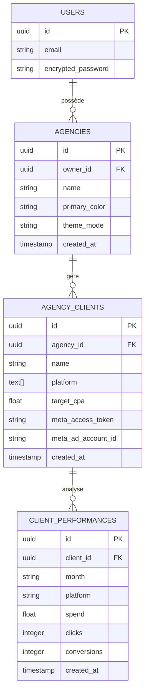

# MetricFlow OS

## Description du Projet
MetricFlow OS est une infrastructure SaaS Multi-Tenant développée pour les agences de marketing digital. 
**Problématique :** Les agences perdent un temps critique sur la consolidation manuelle des données publicitaires (Meta, Google) et réagissent trop lentement face aux baisses de rentabilité de leurs clients.
**Solution :** Une plateforme web centralisée permettant la création de portefeuilles clients isolés, l'aspiration automatisée des données via la Graph API de Meta, un portail en marque blanche, et la génération d'audits stratégiques via une Intelligence Artificielle (Gemini).

## Technologies Utilisées
- **Framework :** Next.js 16 (App Router, Server-Side Rendering)
- **Front-end :** React 19, TailwindCSS, Framer Motion, Recharts
- **Base de données & Auth :** Supabase (PostgreSQL, Row Level Security, Auth)
- **IA & APIs :** Google GenAI SDK (Gemini 2.5 Flash), Meta Graph API (OAuth 2.0)

## Architecture

```mermaid
flowchart TD
    subgraph Frontend ["Front-End (Navigateur Client)"]
        UI["Interface React / Next.js"]
        Viz["Recharts & Framer Motion"]
    end

    subgraph Server ["Serveur Next.js (App Router)"]
        Middleware{"proxy.ts (Middleware)<br/>Vérification Cookie JWT"}
        API_Meta["Route API<br/>/api/auth/meta/callback"]
        API_AI["Route API<br/>/api/report"]
    end

    subgraph Database ["Infrastructure Supabase"]
        Auth["Supabase Auth"]
        RLS{"PostgreSQL RLS<br/>(Row Level Security)"}
        DB[("PostgreSQL BDD")]
    end

    subgraph External ["Services Tiers"]
        Meta["Meta Graph API<br/>(OAuth & Insights)"]
        Gemini["Google GenAI<br/>(Gemini 2.5 Flash)"]
    end

    %% Flux Frontend
    UI -->|Requête de page| Middleware
    Middleware -->|Redirection si non-auth| UI
    UI <-->|Login / Sign Up| Auth
    Auth -->|Set JWT Cookie| UI
    UI -->|Render Data| Viz

    %% Flux Base de données
    UI -->|Requêtes Supabase JS| RLS
    RLS -->|Filtre sécurisé| DB
    DB -->|Données autorisées| UI

    %% Flux API AI
    UI -->|Envoi Stats Client| API_AI
    API_AI <-->|Prompt Engineering| Gemini
    API_AI -->|Rapport Texte| UI

    %% Flux API Meta
    UI -->|Redirection OAuth| Meta
    Meta -->|Code Auth| API_Meta
    API_Meta <-->|Échange Token (Long Lived)| Meta
    API_Meta -->|Update Token RLS| DB
```

> Notre architecture sépare strictement les accès. Les appels API critiques et les échanges de jetons OAuth se font côté serveur via les Route Handlers de Next.js pour éviter d'exposer les variables d'environnement.

## Base de Données



> La base de données PostgreSQL est structurée de manière relationnelle autour des tables `agencies`, `agency_clients` et `client_performances`. La sécurité est assurée par le Row Level Security (RLS) garantissant l'étanchéité des données entre les utilisateurs.

## Installation & Lancement

1. Cloner le repository :
```bash
git clone [https://github.com/votre-compte/metricflow.git](https://github.com/votre-compte/metricflow.git)
cd metricflow
```

2. Installer les dépendances :
```bash
npm install
```

3. Configuration des variables d'environnement :
Créer un fichier `.env.local` et y insérer les clés Supabase, Meta API et Gemini API.

4. Lancer le serveur de développement :
```bash
npm run dev
```

## Tests
Les tests s'effectuent manuellement sur l'environnement de développement :
- Test du flux d'inscription et de la génération des cookies de session via Supabase Auth.
- Vérification du Middleware `proxy.ts` pour empêcher l'accès aux pages protégées.
- Tests d'intégration de l'API Meta (récupération de jeton et aspiration de KPIs fictifs ou réels).
- Vérification des politiques RLS via des tentatives d'accès inter-clients.

## Bugs restants à résoudre
- Gestion d'erreur approfondie si l'API Meta rejette un jeton "long-lived" expiré.
- Affinage du typage de certains retours d'API dynamiques dans Recharts.

## Les Créateurs
- **Bernis** - Lead Full-Stack & DevOps (bernis@email.com | [LinkedIn](#))
- **Janice** - Front-End Dev & UX/UI (janice@email.com | [LinkedIn](#))